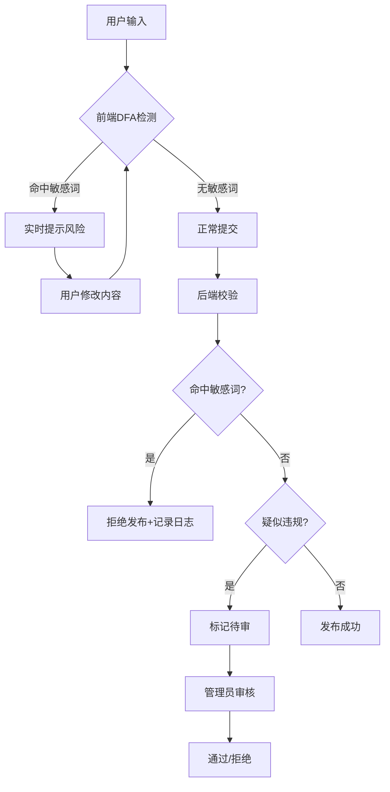

## 1. 产品概述
实验中学论坛是一个面向七至九年级师生的校园互动平台，融合Apple Liquid Glass液态玻璃质感与Google Gemini活力渐变配色，内置企业级敏感词识别系统，确保内容合规与校园安全。

## 2. 核心功能

### 2.1 用户角色
| 角色 | 注册方式 | 核心权限 |
|------|---------|---------|
| 学生 | 邮箱注册+身份选择 | 发帖、评论 |
| 教师 | 邮箱注册+身份选择 | 发帖、置顶、加精 |
| 管理员 | 后台创建 | 全部权限+敏感词库管理 |

### 2.2 功能模块
1. **首页**: 年级板块入口、热门帖子、公告展示
2. **注册/登录页**: 身份选择、密码校验、滑块验证、用户协议确认
3. **七年级 · 启航**: 新生适应、学习方法、社团招新
4. **八年级 · 深耕**: 学科答疑、竞赛交流、心理健康
5. **九年级 · 冲刺**: 中考资料、志愿填报、学长学姐经验分享
6. **帖子详情页**: 帖子内容、评论区、敏感词预检
7. **发布页**: 发帖表单、实时敏感词检测
8. **管理员后台**: 数据看板、用户管理、内容审核、敏感词库管理

### 2.3 页面详情
| 页面名称 | 模块名称 | 功能描述 |
|---------|---------|---------|
| 首页 | 导航栏 | 液态玻璃导航、年级板块快速切换 |
| 首页 | Hero区域 | 动态渐变背景、公告轮播 |
| 首页 | 帖子列表 | 交错淡入动画、卡片式布局 |
| 注册页 | 身份选择 | 学生/教师强制选择 |
| 注册页 | 表单验证 | 密码正则校验、实时提示 |
| 注册页 | 滑块验证 | 人机验证组件 |
| 注册页 | 用户协议 | 打字确认式协议阅读 |
| 发布页 | 敏感词预检 | 实时检测高风险词汇 |
| 管理后台 | 数据看板 | DAU、发帖量、敏感词触发统计 |
| 管理后台 | 敏感词管理 | 添加/删除/编辑敏感词、正则匹配 |

## 3. 核心流程

### 3.1 注册流程
用户进入注册页 → 选择身份(学生/教师) → 填写邮箱密码 → 完成滑块验证 → 阅读并打字确认用户协议 → 提交注册 → 系统校验 → 注册成功

### 3.2 发帖流程
用户进入发布页 → 选择板块 → 填写标题内容 → 前端敏感词预检 → 提交 → 后端拦截校验 → 通过/拒绝/待审 → 结果反馈

### 3.3 敏感词处理流程
前端输入 → 实时DFA检测 → 提示风险 → 提交 → 后端校验 → 命中敏感词拒绝/疑似内容标记待审 → 管理员审核

## 4. 用户界面设计

### 4.1 设计风格
- **液态玻璃美学**: backdrop-filter: blur(16px)、半透明边框、微光折射效果、有机圆角
- **Gemini色彩体系**: 主色调深空灰/纯白玻璃底色，强调色动态渐变(#00E5FF → #2979FF → #D500F9)
- **字体**: 中文使用思源黑体，英文使用Inter
- **布局**: 卡片式、Mobile First响应式设计

### 4.2 页面设计概述
| 页面名称 | 模块名称 | UI元素 |
|---------|---------|-------|
| 首页 | 导航栏 | 玻璃质感、渐变logo、响应式菜单 |
| 首页 | Hero区域 | 动态渐变背景、毛玻璃卡片、浮动动画 |
| 首页 | 帖子列表 | 液态玻璃卡片、交错淡入动画、hover效果 |
| 注册页 | 表单容器 | 玻璃质感卡片、微光边框、渐变按钮 |
| 管理后台 | 侧边栏 | 深色玻璃面板、图标导航 |
| 管理后台 | 数据看板 | 玻璃卡片、渐变图表、实时数据 |

### 4.3 响应式设计
- 移动端(≤768px): 单列布局、底部导航、卡片全宽
- 平板端(769px-1024px): 双列布局、侧边栏折叠
- 桌面端(≥1025px): 完整布局、侧边栏展开、多列网格

### 4.4 交互动效
- Framer Motion页面过渡
- 按钮液态填充动画
- 列表项交错淡入
- 卡片hover上浮效果
- 敏感词高亮闪烁提示

## 5. 安全与合规

### 5.1 敏感词识别系统
- 前端预检: 输入时实时检测高风险词汇
- 后端拦截: 发布接口强制校验
- 异步复审: 疑似违规内容标记待审

### 5.2 词库管理
- 自定义添加/删除敏感词
- 正则匹配支持
- 拼音变体识别

### 5.3 认证安全
- 密码强度校验: /^(?=.*[a-z])(?=.*[A-Z])(?=.*\d).{8,}$/
- 滑块人机验证
- RBAC权限控制

### 5.4 用户协议
- 强制阅读
- 打字确认方式
- 包含免责声明、隐私政策、用户协议