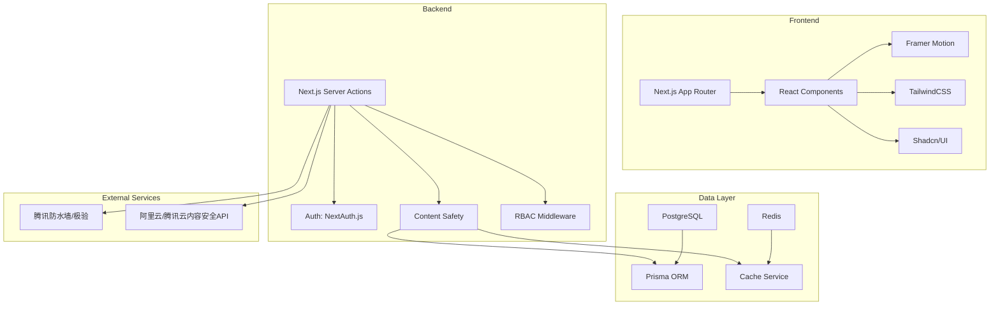
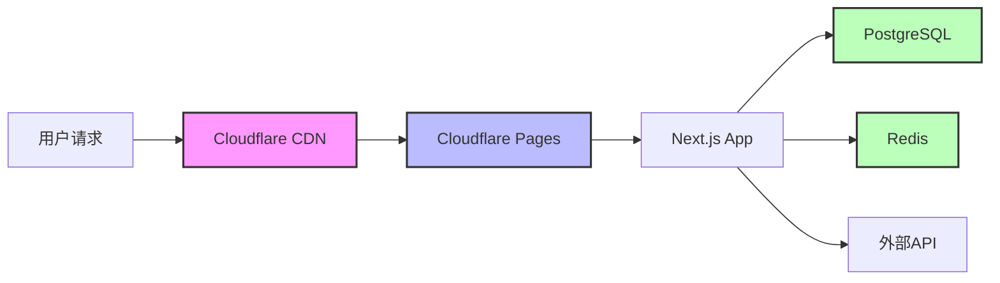

## 1. 架构设计



## 2. 技术栈

| 层级 | 技术 | 版本 |
|-----|------|-----|
| 前端框架 | Next.js | 14+ (App Router) |
| 状态管理 | Zustand | 4+ |
| 样式 | TailwindCSS | 3+ |
| 动画 | Framer Motion | 10+ |
| UI组件 | Shadcn/UI | latest |
| 图标 | Lucide React | latest |
| 后端 | Next.js Server Actions | 14+ |
| ORM | Prisma | 5+ |
| 数据库 | PostgreSQL | 16+ |
| 缓存 | Redis | 7+ |
| 认证 | NextAuth.js | 4+ |
| 部署 | Cloudflare Pages / Vercel | latest |

## 3. 路由定义

| 路由 | 用途 | 权限 |
|-----|------|-----|
| / | 首页 | 公开 |
| /register | 注册页 | 公开 |
| /login | 登录页 | 公开 |
| /grade/7 | 七年级板块 | 登录 |
| /grade/8 | 八年级板块 | 登录 |
| /grade/9 | 九年级板块 | 登录 |
| /post/[id] | 帖子详情 | 登录 |
| /post/create | 发布帖子 | 登录 |
| /admin | 管理后台首页 | 管理员 |
| /admin/dashboard | 数据看板 | 管理员 |
| /admin/users | 用户管理 | 管理员 |
| /admin/content | 内容审核 | 管理员 |
| /admin/settings | 系统配置 | 管理员 |
| /admin/sensitive-words | 敏感词管理 | 管理员 |

## 4. API定义

### 4.1 认证接口

| 接口 | 方法 | 描述 |
|-----|------|-----|
| /api/auth/register | POST | 用户注册 |
| /api/auth/login | POST | 用户登录 |
| /api/auth/logout | POST | 用户退出 |
| /api/auth/session | GET | 获取会话 |

### 4.2 帖子接口

| 接口 | 方法 | 描述 |
|-----|------|-----|
| /api/posts | GET | 获取帖子列表 |
| /api/posts | POST | 创建帖子 |
| /api/posts/[id] | GET | 获取帖子详情 |
| /api/posts/[id] | PUT | 更新帖子 |
| /api/posts/[id] | DELETE | 删除帖子 |

### 4.3 评论接口

| 接口 | 方法 | 描述 |
|-----|------|-----|
| /api/posts/[id]/comments | GET | 获取评论列表 |
| /api/posts/[id]/comments | POST | 创建评论 |

### 4.4 敏感词接口

| 接口 | 方法 | 描述 |
|-----|------|-----|
| /api/sensitive-words | GET | 获取敏感词列表 |
| /api/sensitive-words | POST | 添加敏感词 |
| /api/sensitive-words/[id] | PUT | 更新敏感词 |
| /api/sensitive-words/[id] | DELETE | 删除敏感词 |
| /api/sensitive-words/validate | POST | 验证内容 |

### 4.5 管理接口

| 接口 | 方法 | 描述 |
|-----|------|-----|
| /api/admin/stats | GET | 获取统计数据 |
| /api/admin/users | GET | 获取用户列表 |
| /api/admin/users/[id] | PUT | 更新用户状态 |
| /api/admin/posts/pending | GET | 获取待审帖子 |
| /api/admin/posts/[id]/approve | POST | 审核通过 |
| /api/admin/posts/[id]/reject | POST | 拒绝审核 |

## 5. 数据模型

### 5.1 ER图

```mermaid
erDiagram
    USER ||--o{ POST : creates
    USER ||--o{ COMMENT : creates
    USER ||--o{ USER_ROLE : has
    ROLE ||--o{ USER_ROLE : assigned_to
    POST ||--o{ COMMENT : has
    POST ||--o{ POST_STATUS : has
    GRADE ||--o{ POST : belongs_to
    SENSITIVE_WORD ||--o{ SENSITIVE_WORD_LOG : triggers
    
    USER {
        id UUID PK
        email String UK
        password String
        name String
        role String
        identity String
        grade Int
        status String
        createdAt DateTime
        updatedAt DateTime
    }
    
    POST {
        id UUID PK
        userId UUID FK
        gradeId Int FK
        title String
        content String
        status String
        isTop Boolean
        isEssential Boolean
        viewCount Int
        createdAt DateTime
        updatedAt DateTime
    }
    
    COMMENT {
        id UUID PK
        postId UUID FK
        userId UUID FK
        content String
        status String
        createdAt DateTime
    }
    
    ROLE {
        id UUID PK
        name String UK
        permissions String[]
        createdAt DateTime
    }
    
    USER_ROLE {
        userId UUID FK
        roleId UUID FK
        PK(userId, roleId)
    }
    
    GRADE {
        id Int PK
        name String
        description String
        createdAt DateTime
    }
    
    POST_STATUS {
        id Int PK
        name String
        description String
    }
    
    SENSITIVE_WORD {
        id UUID PK
        word String
        type String
        isRegex Boolean
        pinyinVariants String[]
        createdAt DateTime
        updatedAt DateTime
    }
    
    SENSITIVE_WORD_LOG {
        id UUID PK
        wordId UUID FK
        content String
        userId UUID FK
        action String
        createdAt DateTime
    }
```

### 5.2 数据定义

#### 用户表 (User)
| 字段 | 类型 | 约束 | 说明 |
|-----|------|-----|-----|
| id | UUID | PK | 主键 |
| email | String | UK | 邮箱 |
| password | String | - | 加密密码 |
| name | String | - | 昵称 |
| role | String | - | 角色: student/teacher/admin |
| identity | String | - | 身份: student/teacher |
| grade | Int | nullable | 年级: 7/8/9 |
| status | String | - | 状态: active/banned/pending |
| createdAt | DateTime | - | 创建时间 |
| updatedAt | DateTime | - | 更新时间 |

#### 帖子表 (Post)
| 字段 | 类型 | 约束 | 说明 |
|-----|------|-----|-----|
| id | UUID | PK | 主键 |
| userId | UUID | FK | 用户ID |
| gradeId | Int | FK | 年级ID |
| title | String | - | 标题 |
| content | String | - | 内容 |
| status | String | - | 状态: pending/approved/rejected |
| isTop | Boolean | default: false | 是否置顶 |
| isEssential | Boolean | default: false | 是否加精 |
| viewCount | Int | default: 0 | 浏览数 |
| createdAt | DateTime | - | 创建时间 |
| updatedAt | DateTime | - | 更新时间 |

#### 评论表 (Comment)
| 字段 | 类型 | 约束 | 说明 |
|-----|------|-----|-----|
| id | UUID | PK | 主键 |
| postId | UUID | FK | 帖子ID |
| userId | UUID | FK | 用户ID |
| content | String | - | 内容 |
| status | String | - | 状态: pending/approved/rejected |
| createdAt | DateTime | - | 创建时间 |

#### 敏感词表 (SensitiveWord)
| 字段 | 类型 | 约束 | 说明 |
|-----|------|-----|-----|
| id | UUID | PK | 主键 |
| word | String | - | 敏感词 |
| type | String | - | 类型: banned/suspect |
| isRegex | Boolean | default: false | 是否正则 |
| pinyinVariants | String[] | - | 拼音变体 |
| createdAt | DateTime | - | 创建时间 |
| updatedAt | DateTime | - | 更新时间 |

#### 敏感词日志表 (SensitiveWordLog)
| 字段 | 类型 | 约束 | 说明 |
|-----|------|-----|-----|
| id | UUID | PK | 主键 |
| wordId | UUID | FK | 敏感词ID |
| content | String | - | 命中内容 |
| userId | UUID | FK | 用户ID |
| action | String | - | 动作: reject/pending |
| createdAt | DateTime | - | 创建时间 |

#### 年级表 (Grade)
| 字段 | 类型 | 约束 | 说明 |
|-----|------|-----|-----|
| id | Int | PK | 年级ID |
| name | String | - | 年级名称 |
| description | String | - | 描述 |
| createdAt | DateTime | - | 创建时间 |

## 6. 敏感词过滤服务设计

### 6.1 DFA算法实现
- 构建敏感词字典树
- 遍历文本进行匹配
- 支持最短/最长匹配模式

### 6.2 拼音转换
- 使用pinyin库进行拼音转换
- 支持全拼/简拼匹配
- 存储拼音变体用于快速查找

### 6.3 正则匹配
- 支持正则表达式敏感词
- 预编译正则表达式提高性能

### 6.4 Redis缓存
- 缓存敏感词字典树
- 设置过期时间自动刷新
- 支持手动刷新缓存

## 7. 部署架构



### 7.1 Cloudflare部署配置
- Build Command: `npm run build`
- Build Output Directory: `.next`
- Environment Variables配置

### 7.2 SEO优化
- 百度/必应搜索引擎提交
- 站点地图生成
- Meta标签优化
- ICP备案配置